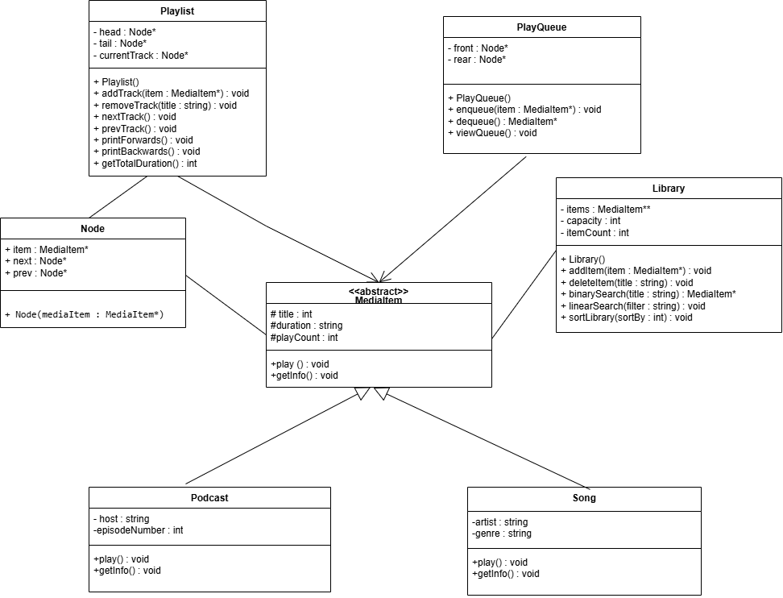

# Playlist Manager Application - C++ Track

A C++ console-based music application that manages a library of songs and podcasts, custom dynamic playlists, playback queues, and playback history using advanced data structures and algorithms.

---

## 👥 Team Members & Contributions

| Member Name | Role & Contributions |
| :--- | :--- |
| **Nourhan Ahmed Kamal** | Architecture, Doubly Linked List, Queue, History Stack (Bonus), UML Diagram, & README |
| **Team Member 2** | MediaItem Inheritance, Song & Podcast classes, Output Matching |
| **Team Member 3** | Search & Sorting Algorithms (Binary Search, Selection Sort), Recursion |
## 📊 Algorithms & Data Structures Complexity (Big O)

| Operation / Algorithm | Data Structure / Implementation | Time Complexity (Best) | Time Complexity (Average/Worst) | Space Complexity |
| :--- | :--- | :---: | :---: | :---: |
| **Search by Title** | Sorted Array (Binary Search) | O(1) | O(log N) | O(1) |
| **Filter by Artist / Genre** | Dynamic Array (Linear Search) | O(1) | O(N) | O(1) |
| **Sort Library** | Selection Sort | O(N^2)| O(N^2) | O(1) |
| **Next / Previous Track** | Doubly Linked List (Playlist) | O(1) | O(1) | O(1) |
| **Add Track to Playlist** | Doubly Linked List | O(1) | O(1) | O(1) |
| **Remove Track from Playlist**| Doubly Linked List | O(1) | O(N) | O(1) |
| **Enqueue / Dequeue Track** | Custom Queue (PlayQueue) | O(1) | O(1) | O(1) |
| **Calculate Total Duration** | Recursive Function | O(N) | O(N) | O(N) *(Call Stack)* |
| **Print Playlist Backwards** | Recursive Function | O(N) | O(N) | O(N) *(Call Stack)* |

---

## 🛠️ How to Compile and Run

Make sure you have a C++ compiler installed (`g++`). Run the following commands in your terminal:

```bash
# Compile all source files
g++ -std=c++11 src/*.cpp -Iinclude -o playlist_manager

# Run executable
./playlist_manager
---

## 📐 UML Class Diagram



---

## 📷 App Screenshots

*(Add 2 or 3 screenshots of your app running here)*
