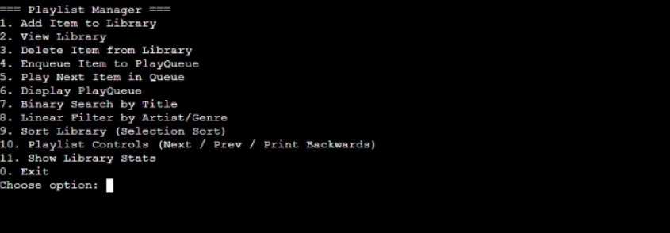

# Playlist Manager Application - C++ Track

A C++ console-based music application that manages a library of songs and podcasts, custom dynamic playlists, playback queues, and playback history using advanced data structures and algorithms.

---

## 👥 Team Members & Contributions

| Member Name | Role & Contributions |
| --- | --- |
| **Nourhan Ahmed Kamal** | Architecture, Doubly Linked List, Queue, History Stack (Bonus), UML Diagram, & README |
| **Team Member 2** | MediaItem Inheritance, Song & Podcast classes, Output Matching |
| **Team Member 3** | Search & Sorting Algorithms (Binary Search, Selection Sort), Recursion |

---

## 🛠️ How to Compile and Run

Make sure you have a C++ compiler installed (`g++`). Run the following commands in your terminal:

\`\`\`bash
# Compile all source files
g++ -std=c++11 src/*.cpp -Iinclude -o playlist_manager

# Run executable
./playlist_manager
\`\`\`

---

## 📊 Big O Complexity Analysis

| Operation | Function / Method | Data Structure / Algorithm | Time Complexity | Complexity Reasoning |
| --- | --- | --- | --- | --- |
| **Playlist Traversal** | nextTrack(), prevTrack() | Doubly Linked List | O(1) | Direct pointer navigation using next and prev. |
| **Queue Operations** | enqueue(), dequeue() | Custom Queue | O(1) | Direct insertion at rear and removal from front. |
| **History Operations** | push(), pop() | History Stack (Array) | O(1) | LIFO push/pop for the last 10 played tracks. |
| **Exact Search** | searchBinary() | Binary Search (Array) | O(log n) | Divides sorted library in half each step. |
| **Filter Items** | filterLinear() | Linear Search | O(n) | Scans array elements to match artist or genre. |
| **Sort Library** | sortLibrary() | Selection Sort | O(n^2) | In-place sorting with explicit comparison metrics. |
| **Recursive Sum** | getTotalDuration() | Recursion | O(n) | Recursively sums track durations across nodes. |
| **Print Backwards** | printBackwards() | Recursion | O(n) | Call stack traversal using prev pointers. |

---

## 📐 UML Class Diagram

---

## 📸 Program Screenshots

---

## 🎁 Bonus Features Included
* **Playback History Stack:** A custom LIFO stack tracking the last 10 played tracks (most recent first).
